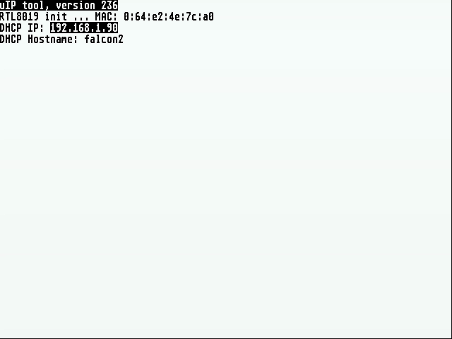
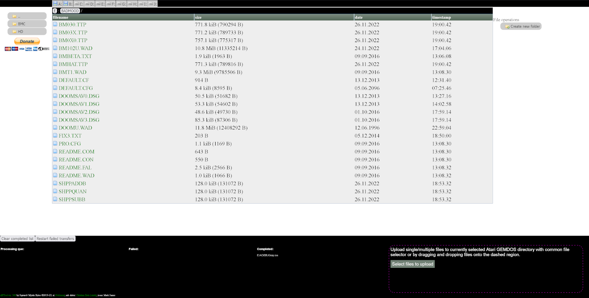
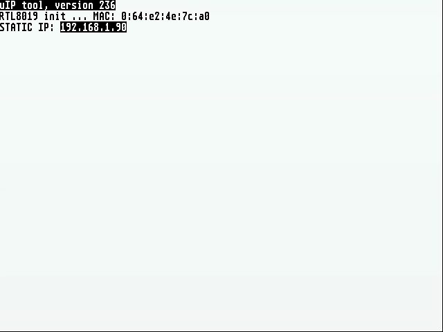

# Uiptool Introduction

Uip-tools brings an easy way to upload or download files to your beloved TOS machine with NetUSBee compatible network adapter **without** a need for **MiNT** or **STING** TCP/IP stacks.
It is a self contained binary, including a TCP/IP stack based on uIP embedded stack with DHCP support included.

You can support development of this tool via PayPal:


[](https://www.paypal.com/cgi-bin/webscr?cmd=_s-xclick&hosted_button_id=L766684U4EYJW)


[TOC]

# Downloads:

 [Files can be downloaded here](https://bitbucket.org/sqward/uip-tools/downloads/)


# Requirements

**Uiptool** requires an Atari machine TOS operating system. It should work with all know versions but it's advised to use it on the most recent version as possible. Normally the tool is developed on Atari Falcon. **MiNT** and **STING/STiK** will be detected and **uiptool** will **ABORT** if present.

A **NetUSBee** Ethernet addon or **Ethernac** compatible hardware is also required.

# Security

Obviously, you should never expose your uiptool IP/port to the internet! Absolutly no effort was expanded at hardening the uiptool. It should *ONLY* be used in a trusted environment!

# Usage

Main usage scenario is to use a web browser as a frontend. After you start **uiptool** on your Atari computer you'll see a similar screen:



You can see the MAC address of the Ethernet chip displayed and further, IP address obtained from **DHCP** server. At this point you can type that IP address into web browser on your PC to connect to the user interface.

## Web interface
Interface relies on HTML5, so only modern browsers are supported (Firefox / Chrome).



In upper part there is a list of GEMDOS drives detected. Clicking on them changes current GEMDOS drive and displays it's root directory.
By default "C" drive is displayed, if there is no hard drive, only floppy drives are displayed and "A" drive is set as default active drive.
Below hard drive list on the left side there is list of folders, on the right side there is a list of files in current path.
By clicking on directory in left panel or on breadcrumb elements above file view user can navigate through folder hierarchy on remote Atari machine. By clicking on file download to PC is initiated.

Bottom part is divided into two parts.
Files and whole folders can be drag and dropped onto bottom / right part to initiate upload to currently set GEMDOS path. Alternatively clicking "Select files to upload" button will bring up system file selector, so desired files can be selected and uploaded.
Right portion of bottom panel displays the processing of upload que, shows failed and completed transfers.

## FTP server
A simple FTP server on a default port is now available with a limited command support. Although simple it is sufficient to allow most PC clients (Filezilla, WinSCP, Total Commander tested and working fine). No login credentials are required. Anonumous login should work. Also, any made up credentials will allow to login.

Make sure to use PASSIVE mode in your client! Just use the IP address displayed by uiptool as your FTP server address.

## DHCP and STATIC IP Operating Mode

**Uiptool** can operate in two modes: **DHCP** or **STATIC IP** modes. In general it is advised to use **DHCP** mode as this requires no additional configuration from the user and network access will be configured automatically. However, for special purposes, **STATIC IP** mode has been added. This can be useful when no DHCP server is available. For example, if there's no router available and user wants to transfer files directly from their laptop. This should work fine if both machines are manually configured and a crossover cable or [auto MDI-X](https://en.wikipedia.org/wiki/Auto_MDI-X) is available.

Once **STATIC IP** is toggled you should see something like this:



To toggle between **DHCP** and **STATIC IP** use **F1** key. When toggled for the first time a config fill will be saved alongside **uiptool** executable. User is expected to edit that file with a text editor to set IP address, netmask, and gateway which corresponds with their configuration.

## Available "API"

In addition to the HTML based user interface, **uiptool** allows you to use a simple **API** to do a range of operations. All examples are provided as curl shell invocations.

### Upload a File

```
curl -0T filename.tos 192.168.1.1/d/filename.tos
```

Note that you need to specify not only destination folder but also a file name!

### Download a File

```
curl -0 192.168.1.1/c/filename.tos
```

### Run an executable:

```
curl -0 192.168.1.1/c/filename.tos?run="command line"
```

The executable needs to be already present on the recent machine.

### Delete a File:

```
curl -0X DELETE 192.168.1.1/c/filename.tos
```

### Create a Folder

```
curl -0 192.168.1.1/c/foldername?newfolder
```

### Request File Info or Directory Listing in JSON Format

```
curl -0 192.168.1.1/c/filename.tos?dir
curl -0 192.168.1.1/c/foldername?dir
```

## Usage as a Development Tool

Two convenience scripts are provided with **uiptool**:

* **uip-deploy.py** - copy local files (from user's PC) to TOS machine. It's meant as a one way synchronisation   method where files are only changed on source machine. This would be the case for software development setup where files are built/modified on a PC and copied to TOS machine. Only files which have changed since previous use of this tool will be copied. This is achieved through a checksum file stored on a remote machine which is requested when the tool is executed and then used to calculate changes in the local directory. Usage:

  ```
            uip-deploy.py source/folder host/drive/folder
  ```

* **uip-run.py** - this tool is used to execute a binary remotely and **redirect** terminal output. This is quite handy for logging and debugging purposes. The binary being run needs to use **GEMDOS** functions for character input/output for the redirection to work. Technically speaking redirection uses UDP for communication as this has less overhead, state and in general is less cumbersome to use in a situation where UIP is not in control of execution. When remote application exits, so does the script. This could be triggered by a key press on a PC or TOS machine. While terminal output is redirected and no local output can be seen, input, on the other hand, is a combination of remote input and local keyboard. This is useful for situations when somethings goes wrong with the redirection (**Control-C** for example) and user ends up in a situation where remote application is still executing while **uip-run.py** exits. Usage:

  ```
            uip-run.py host/drive/path/binary.tos
  ```

These two scripts used together can organize deployment and execution of local builds and significantly speed up development process.

Scripts can be found [here](https://bitbucket.org/sqward/uip-tools/src/master/scripts/)


# Performance

Transfer performance can vary greatly depending on machine configuration. Hard disk speed and CPU clock are the most important factors when it comes to the performance. Another bottleneck for **NetUSBee** is the ROM port speed. A stock Falcon is able to, just about, read enough raw packets from **NetUSBee** to reach 10Mbps limit of the card but other factors like handling of the TCP/IP stack and file IO means that practically this can never be achieved.

| Machine                  | Upload Speed (host->**uiptool**) | Download speed (**uiptool**->host) |
| ------------------------ | :--------------------------- | :----------------------------- |
| Atari Falcon stock       | ~350KB/s                   | ~200KB/s                      |
| Atari Falcon 060/95Mhz   | ~550KB/s                     | ~400KB/s                      |
| Atari ST with UltraSatan | ~200KB/s                    | ~150KB/s                      |
| Atari TT 32Mhz           | ~400KB/s                    | ~300KB/s                      |

## Impact of USB drivers on uiptool performance

Because **USB** is rather demanding protocol for an old systems like TOS machines, running **USB** drivers for **NetUSBee** alongside **uiptool** will reduce network transfers by as much as 40%! It is strongly advised users do not use these drivers when using **uiptool** for **optimal performance**.  

# Building

## Prerequisites

In order to build **uiptool** following prerequisites are needed:

- Cygwin or Linux environment
- m68k-atari-mint cross compiler (http://vincent.riviere.free.fr/soft/m68k-atari-mint)
- vasm m68k cross compiler (http://sun.hasenbraten.de/vasm)
- Scons
- xxd

For CSS/JS automatic minificationin release builds nodeJS version 11.9.0 is required (https://nodejs.org/en/) with the following packages installed:

```
npm install uglify-js -g
npm install less -g
```

## Invoking the build system

then finally building the source with following commands:

```
bash# mkdir uip-tools.build
bash# cd uip-tools.build
bash# scons -C ../uip-tools
```

## Optional tools and dependencies

It's possible to build the project with libcmini (https://github.com/mfro0/libcmini) like follows:

```
bash#  LIBCMINI=/path/libcmini/libcmini/build/ scons -C ../uip-tools
```

This cuts about 100KB of the executable size.

If UPX is detected during the build then it will be used to compress the resulting in even smaller binary. If environment variable **NOUPX** is present then UPX will not be used.

# Thanks and acknowledgments

Thanks to **[jamesfmackenzie](https://www.youtube.com/watch?v=m3Lk96knpI0)** for his great YouTube video demonstrating usage of older **uiptool** version.

Thanks to **[Lotharek](https://lotharek.pl/)** for manufacturing **NetUSBee** devices

Thanks to **Kroll** and **Piter** for testing and support.

Thanks to Atari community for great feedback on the tool.